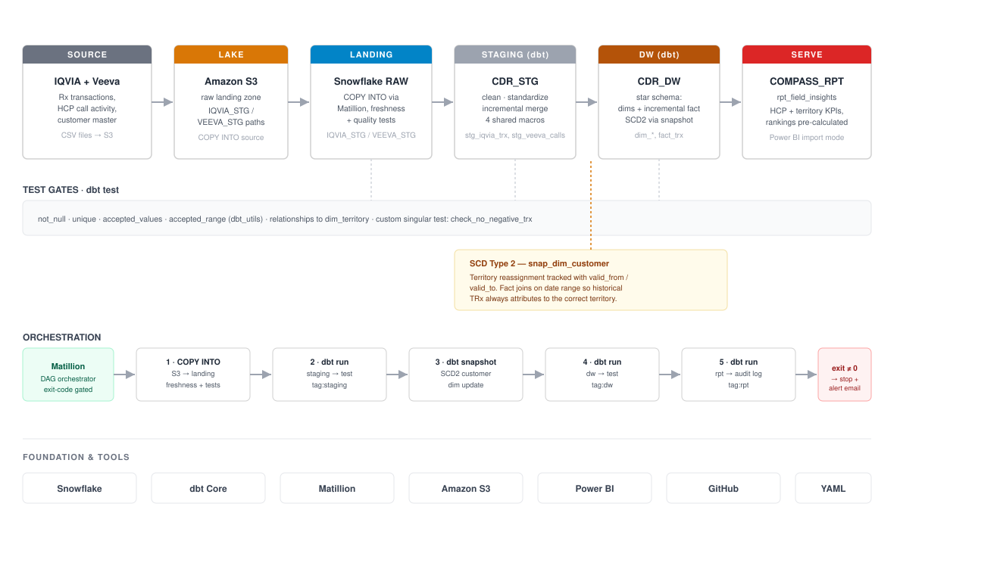

# Compass DBT — Snowflake Data Warehouse Pipeline

A dbt project that builds a layered data warehouse on Snowflake for pharma commercial analytics — combining prescription data (IQVIA) and CRM call activity (Veeva) into a single reporting layer consumed by Power BI.




## Overview

This project models raw prescription and field-activity data through four layers — **landing → staging → dw → rpt** — with data quality tests gating each transition. Orchestration is handled by Matillion, which triggers `dbt run` / `dbt test` commands in sequence and stops the pipeline on any failure.

```
compass_dbt/
├── dbt_project.yml
├── profiles.yml
├── sources.yml
├── models/
│   ├── landing/          # raw source declarations + freshness/quality tests
│   │   └── schema.yml
│   ├── staging/          # incremental, cleaned & standardized
│   │   ├── stg_iqvia_trx.sql
│   │   ├── stg_veeva_calls.sql
│   │   └── schema.yml
│   ├── dw/                # dimensional model
│   │   ├── dim_customer.sql
│   │   ├── dim_products.sql
│   │   ├── dim_territory.sql
│   │   ├── dim_time.sql
│   │   ├── fact_trx.sql
│   │   └── schema.yml
│   └── rpt/               # wide reporting table for BI
│       ├── rpt_field_insights.sql
│       └── schema.yml
├── snapshots/
│   └── snap_dim_customer.sql   # SCD Type 2 on customer/territory
├── macros/
│   ├── clean_string.sql
│   ├── safe_numeric.sql
│   ├── time_bucket.sql
│   └── product_segment.sql
├── seeds/
│   └── product_master.csv
└── tests/
    └── check_no_negative_test.sql
```

## Architecture

**1. Landing** — Raw files are loaded from S3 into Snowflake via `COPY INTO`, orchestrated by Matillion. `sources.yml` declares freshness checks (warn after 24h, error after 48h) so stale loads are caught before they propagate downstream.

**2. Staging** — Incremental models clean and standardize the raw data. A handful of macros (`clean_string`, `safe_numeric`, `time_bucket`, `product_segment`) centralize common transformations so they're written once and reused across models instead of duplicated in every query.

**3. Snapshots (SCD2)** — `snap_dim_customer.sql` tracks changes to HCP/territory assignments over time using dbt's snapshot feature. When a doctor's territory changes, the old record is closed out with a `valid_to` date and a new row is inserted — so historical fact records always join to the territory that was active at the time.

**4. DW (dimensional model)** — Standard star schema: `dim_customer`, `dim_products`, `dim_territory`, `dim_time`, and `fact_trx`. The fact table pre-calculates metrics like territory share % and growth rates using window functions, so BI tools don't have to recompute them at query time.

**5. RPT** — `rpt_field_insights` flattens everything into one wide table — HCP-level detail plus territory rollups plus rankings — built specifically for Power BI import mode.

## Testing

Data quality is enforced with dbt tests at multiple layers:
- `not_null` / `unique` on primary keys (e.g. `MDM_ID`)
- `accepted_values` on categorical fields (e.g. product codes)
- A custom singular test (`check_no_negative_test.sql`) rejecting negative transaction counts

Tests run as gates between layers in the orchestration sequence — if landing tests fail, staging never builds.

## Orchestration

Matillion drives the pipeline end-to-end:

1. `COPY INTO` — load raw files from S3
2. `dbt source freshness` + landing tests
3. `dbt run --select tag:staging`
4. `dbt test --select tag:staging`
5. `dbt snapshot`
6. `dbt run --select tag:dw`
7. `dbt test --select tag:dw`
8. `dbt run --select tag:rpt`
9. Write pipeline status to an audit log table

A non-zero exit code at any step halts the DAG.

## Tech stack

- **dbt** — transformation, testing, documentation
- **Snowflake** — warehouse
- **Matillion** — orchestration
- **Power BI** — reporting layer (import mode)
- **AWS S3** — raw file landing zone

## Getting started

```bash
git clone https://github.com/PULKIRSRIVASTAVA98/Dbt_snowflake.git
cd Dbt_snowflake

# set env vars for Snowflake credentials
export DBT_DEV_PASSWORD=your_password

dbt deps
dbt run --target dev
dbt test --target dev
```

## Screenshots

| | |
|---|---|
|  | Project structure in VS Code |
|  | Pushing feature branch to GitHub |
|  | Merged repo on GitHub |
